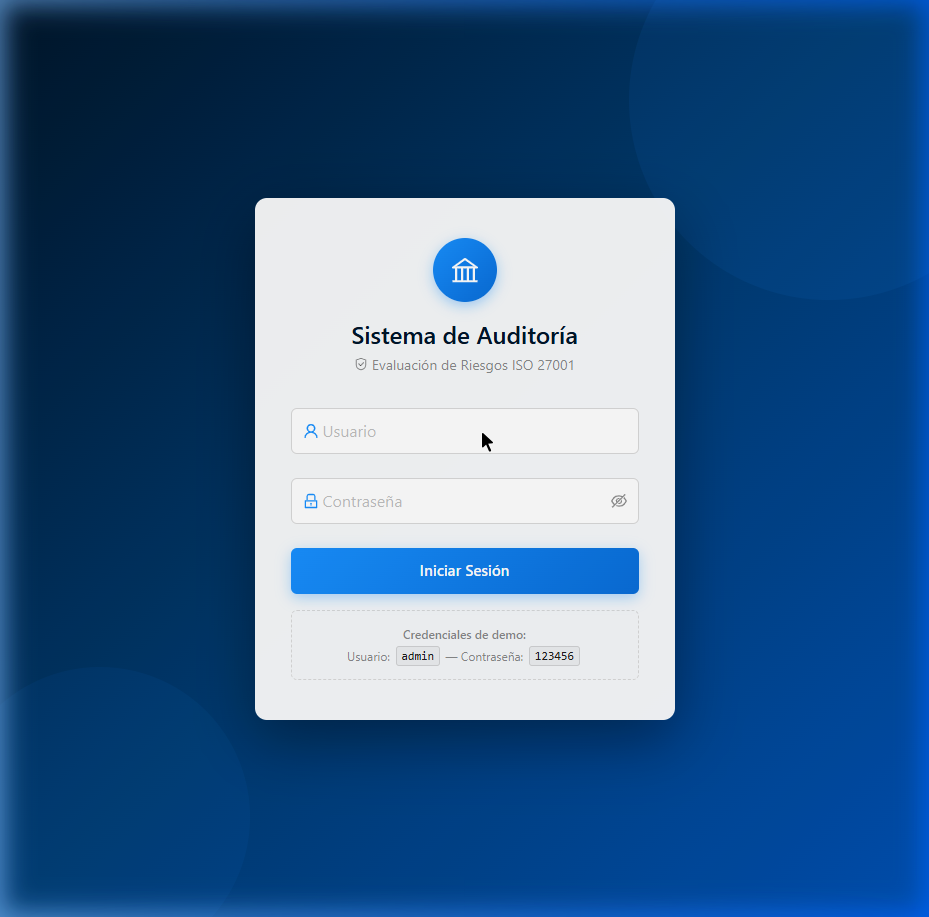
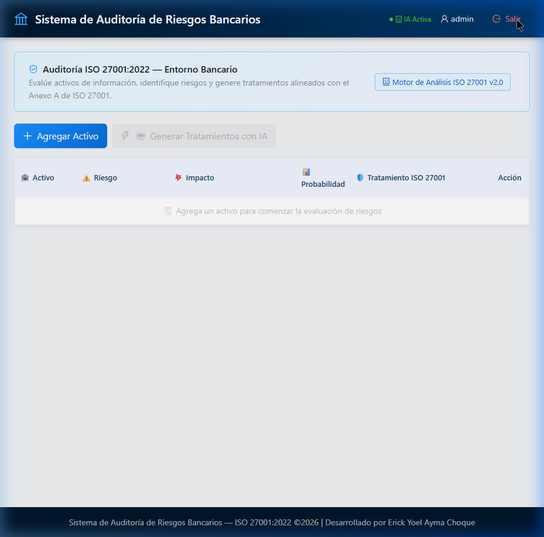
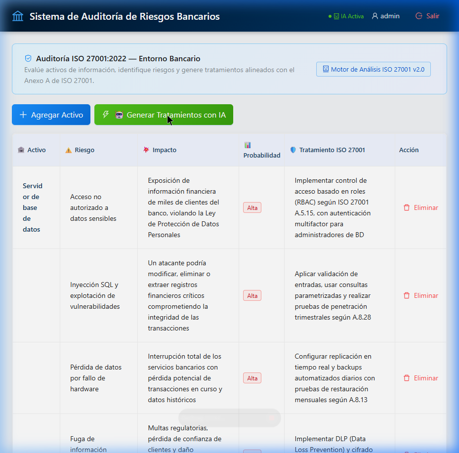

# UNIVERSIDAD PRIVADA DE TACNA

## FACULTAD DE INGENIERÍA

### ESCUELA DE INGENIERÍA DE SISTEMAS

&nbsp;

# Examen de Auditoría Unidad I

&nbsp;

Que se presenta para el curso:

### **"Auditoría de Sistemas"**

&nbsp;

**Alumno:**

| Apellidos y Nombres | Código |
|---|---|
| Ayma Choque, Erick Yoel | 2021072616 |

&nbsp;

**Docente:**

Dr. Oscar Juan Jimenez Flores

&nbsp;

&nbsp;

**TACNA – PERÚ**

**2026**

---

&nbsp;

# Informe de Auditoría de Sistemas - Examen de la Unidad I

**Nombres y apellidos:** Erick Yoel Ayma Choque

**Fecha:** 22 de abril de 2026

**URL GitHub:** [https://github.com/ea2021072616/Examen-U1---Erick-Ayma.git](https://github.com/ea2021072616/Examen-U1---Erick-Ayma.git)

---

## 1. Proyecto de Auditoría de Riesgos

### Login

**Evidencia:**

**Descripción:**

Se implementó un sistema de inicio de sesión ficticio sin base de datos. El sistema utiliza credenciales hardcodeadas (`admin` / `123456`) almacenadas directamente en el archivo `src/services/LoginService.js`. Cuando el usuario ingresa sus credenciales, el servicio las compara con los valores predefinidos. Si coinciden, se genera un token de sesión simulado (mock JWT) y se almacena en `localStorage` del navegador junto con el nombre de usuario, permitiendo mantener la sesión activa entre recargas de página. El componente `Login.jsx` muestra un formulario profesional con validación de campos, manejo de errores y feedback visual de carga. En el backend (`app.py`), también existe un endpoint `/api/login` que replica la misma lógica de autenticación ficticia.

**Credenciales de acceso:**
- **Usuario:** `admin`
- **Contraseña:** `123456`

---

### Motor de Inteligencia Artificial

**Evidencia:**

**Descripción:**

El motor de IA fue mejorado significativamente respecto al código base original. El sistema original dependía de Ollama con el modelo `"ramiro:instruct"` y generaba respuestas mediante un LLM local. El código mejorado implementa un **Motor de Análisis ISO 27001 v2.0** integrado directamente en el backend (`app.py`), que contiene una base de conocimiento (`RISK_DATABASE`) con perfiles de riesgo detallados para 8 activos bancarios. Cada perfil incluye:

- **5 riesgos específicos** por activo
- **5 impactos detallados** contextualizados al entorno bancario
- **5 tratamientos** alineados con controles específicos del Anexo A de ISO 27001:2022
- **Nivel de probabilidad** (Alta/Media/Baja)

Las funciones principales del motor son:
- `get_risk_analysis(activo)`: Busca el activo en la base de conocimiento y retorna riesgos e impactos.
- `get_treatment(activo, riesgo, impacto)`: Genera recomendaciones de tratamiento alineadas con controles ISO 27001.

El frontend (`App.jsx`) conecta con el backend mediante `axios`, enviando peticiones POST a los endpoints `/analizar-riesgos` y `/sugerir-tratamiento`, y muestra los resultados en una tabla interactiva editable.

**Endpoints del motor de IA:**

| Endpoint | Método | Función |
|---|---|---|
| `/analizar-riesgos` | POST | Analiza riesgos e impactos de un activo |
| `/sugerir-tratamiento` | POST | Genera tratamiento ISO 27001 para un riesgo |
| `/evaluar-activo-completo` | POST | Evaluación completa (riesgos + impactos + tratamientos) |
| `/api/ai-status` | GET | Estado del motor de IA |

---

## 2. Hallazgos

### Activo 1: Servidor de Base de Datos

**Evidencia:**

**Condición:**

Se identificaron 5 riesgos críticos en el servidor de base de datos del banco: acceso no autorizado a datos sensibles, vulnerabilidades de inyección SQL, riesgo de pérdida de datos por fallo de hardware, posible fuga de información confidencial de clientes y ausencia de cifrado en datos en reposo. La exposición de información financiera de miles de clientes podría violar la Ley de Protección de Datos Personales, mientras que un atacante podría modificar o extraer registros financieros comprometiendo la integridad de las transacciones bancarias.

**Recomendación:**

- Implementar control de acceso basado en roles (RBAC) según ISO 27001 A.5.15, con autenticación multifactor para administradores de BD.
- Aplicar validación de entradas, usar consultas parametrizadas y realizar pruebas de penetración trimestrales según A.8.28.
- Configurar replicación en tiempo real y backups automatizados diarios con pruebas de restauración mensuales según A.8.13.
- Implementar DLP (Data Loss Prevention) y cifrado AES-256 para datos sensibles según A.8.24.
- Activar TDE (Transparent Data Encryption) y cifrado de columnas para datos PII según A.8.24.

**Riesgo:** Probabilidad **Alta**

---

### Activo 2: Firewall Perimetral

**Evidencia:**

**Condición:**

Se detectaron vulnerabilidades en el firewall perimetral del banco: reglas mal configuradas o excesivamente permisivas, firmware desactualizado, ausencia de monitoreo de tráfico en tiempo real, susceptibilidad a ataques DDoS y posibilidad de bypass mediante tunneling. Un atacante podría acceder a la red interna del banco y moverse lateralmente hacia sistemas críticos. La falta de monitoreo permite que intrusiones pasen desapercibidas durante semanas.

**Recomendación:**

- Realizar auditorías mensuales de reglas del firewall aplicando principio de mínimo privilegio según ISO 27001 A.8.20.
- Establecer programa de gestión de parches con actualizaciones críticas en 24h según A.8.8.
- Implementar sistema SIEM integrado con el firewall para correlación de eventos en tiempo real según A.8.16.
- Contratar servicio de mitigación DDoS y configurar rate limiting según A.8.20.
- Implementar inspección profunda de paquetes (DPI) y filtrado de protocolos según A.8.23.

**Riesgo:** Probabilidad **Alta**

---

### Activo 3: Aplicación Web de Banca

**Evidencia:**

**Condición:**

La aplicación web de banca presenta riesgos de vulnerabilidades XSS y CSRF, autenticación débil, APIs expuestas sin protección adecuada, posibilidad de inyección de código malicioso y falta de cifrado HTTPS en algunas comunicaciones. Un atacante podría robar credenciales bancarias mediante scripts maliciosos inyectados en páginas legítimas del banco, permitiendo transferencias fraudulentas y suplantación de identidad de clientes.

**Recomendación:**

- Implementar Content Security Policy (CSP), tokens anti-CSRF y sanitización de entradas según ISO 27001 A.8.28.
- Configurar MFA obligatorio, tokens JWT con expiración corta y política de contraseñas robusta según A.5.17.
- Implementar API Gateway con rate limiting, autenticación OAuth 2.0 y validación de esquemas según A.8.26.
- Aplicar WAF (Web Application Firewall) y validación del lado servidor para todos los inputs según A.8.28.
- Forzar HTTPS con HSTS, certificados TLS 1.3 y perfect forward secrecy según A.8.24.

**Riesgo:** Probabilidad **Alta**

---

### Activo 4: Backup en NAS

**Evidencia:**

**Condición:**

El sistema de backups en NAS presenta riesgos significativos: backups almacenados sin cifrado, falta de pruebas de restauración periódicas, acceso no restringido al sistema, ausencia de copias offsite y vulnerabilidad ante ransomware. Si un atacante accede a los backups sin cifrar, quedaría expuesta toda la información bancaria histórica. Un ataque de ransomware podría cifrar maliciosamente todos los respaldos, inutilizando la estrategia de recuperación ante desastres.

**Recomendación:**

- Cifrar todos los backups con AES-256 antes de almacenarlos y gestionar claves de forma segura según ISO 27001 A.8.24.
- Programar pruebas de restauración mensuales documentadas y simulacros de recuperación trimestrales según A.8.13.
- Implementar control de acceso estricto a la NAS con autenticación MFA y registros de auditoría según A.5.15.
- Configurar replicación 3-2-1 (3 copias, 2 medios, 1 offsite) con respaldo en nube según A.8.13.
- Implementar backups inmutables (WORM) y segmentación de red para aislar la NAS según A.8.22.

**Riesgo:** Probabilidad **Media**

---

### Activo 5: Contraseñas de Usuarios

**Evidencia:**

**Condición:**

Se identificaron graves riesgos en la gestión de contraseñas: almacenamiento en texto plano, política de contraseñas débil o inexistente, reutilización entre sistemas, ausencia de bloqueo ante fuerza bruta y compartición de credenciales entre empleados. Una brecha en la base de datos expondría masivamente credenciales de clientes y empleados. La reutilización de contraseñas permitiría un compromiso en cascada de múltiples sistemas bancarios.

**Recomendación:**

- Implementar hashing con bcrypt/Argon2 y salt único por usuario según ISO 27001 A.8.24.
- Establecer política de contraseñas mínimo 12 caracteres, complejidad y rotación cada 90 días según A.5.17.
- Implementar SSO con MFA y gestor de contraseñas corporativo para evitar reutilización según A.5.17.
- Configurar bloqueo de cuenta tras 5 intentos fallidos y CAPTCHA progresivo según A.8.5.
- Implementar cuentas nominales individuales con auditoría de acceso según A.5.16.

**Riesgo:** Probabilidad **Alta**

---

### Activo 6: VPN Corporativa

**Evidencia:**

**Condición:**

La VPN corporativa del banco presenta riesgos de configuración con protocolos obsoletos (PPTP, L2TP sin IPSec), falta de segmentación de acceso por perfil, credenciales compartidas entre empleados, ausencia de monitoreo de conexiones y split tunneling habilitado sin restricciones. Un atacante podría interceptar tráfico corporativo o utilizar dispositivos remotos como puente entre internet y la red interna del banco.

**Recomendación:**

- Migrar a protocolos modernos como WireGuard o IKEv2/IPSec con cifrado AES-256-GCM según ISO 27001 A.8.24.
- Implementar Zero Trust Network Access (ZTNA) con acceso basado en roles y microsegmentación según A.8.22.
- Emitir certificados digitales individuales y MFA para cada conexión VPN según A.5.17.
- Integrar logs VPN con el SIEM corporativo para monitoreo y alertas en tiempo real según A.8.16.
- Desactivar split tunneling y forzar todo el tráfico a través del túnel VPN según A.8.20.

**Riesgo:** Probabilidad **Media**

---

### Activo 7: API Transacciones

**Evidencia:**

**Condición:**

La API de transacciones bancarias presenta riesgos críticos: autenticación débil con tokens estáticos, ausencia de rate limiting, exposición de datos sensibles en respuestas, falta de validación de parámetros y documentación pública que expone endpoints internos. Un atacante podría acceder a transacciones financieras realizando consultas y operaciones fraudulentas, o inyectar parámetros maliciosos que manipulen el procesamiento de transacciones.

**Recomendación:**

- Implementar OAuth 2.0 con tokens JWT de corta duración y rotación automática según ISO 27001 A.8.26.
- Configurar rate limiting por usuario/IP y throttling adaptativo según A.8.20.
- Aplicar filtrado de campos sensibles en respuestas y enmascaramiento de datos PII según A.8.11.
- Implementar validación estricta de esquemas con OpenAPI y sanitización de inputs según A.8.28.
- Separar documentación interna de externa y restringir acceso a endpoints administrativos según A.8.3.

**Riesgo:** Probabilidad **Alta**

---

### Activo 8: Plan de Recuperación ante Desastres

**Evidencia:**

**Condición:**

El plan de recuperación ante desastres del banco presenta deficiencias: plan desactualizado, falta de pruebas y simulacros periódicos, RTO y RPO no definidos para sistemas críticos, personal no capacitado en procedimientos de emergencia y dependencia de un único centro de datos. Ante un desastre, el banco podría ser incapaz de restaurar operaciones, causando pérdidas financieras millonarias y tiempos de recuperación que excedan los límites regulatorios.

**Recomendación:**

- Actualizar el DRP semestralmente con revisión de todos los componentes críticos según ISO 27001 A.5.30.
- Ejecutar simulacros de recuperación trimestrales con métricas documentadas según A.5.30.
- Definir RTO máximo de 4h y RPO máximo de 1h para sistemas transaccionales críticos según A.5.30.
- Programa de capacitación semestral con ejercicios de mesa (tabletop) para todo el personal clave según A.6.3.
- Implementar centro de datos secundario activo-activo con failover automático según A.8.14.

**Riesgo:** Probabilidad **Media**

---

## Evaluación

La nota final es la suma de todos los criterios (máx. 20 puntos).

| Criterio | 0 pts | 5 pts | Puntaje Máximo |
|---|---|---|---|
| Login | No presenta evidencia o está incorrecto | Login ficticio completo, funcional y con evidencia clara | 5 |
| IA Funcionando | No presenta IA o está incorrecta | IA implementada, funcionando y con evidencia clara | 5 |
| Evaluación de 5 Activos | Menos de 5 activos evaluados o sin hallazgos válidos | 5 activos evaluados con hallazgos claros y evidencias | 5 |
| Informe claro y completo | Informe ausente, incompleto o poco entendible | Informe bien estructurado y completo según lo requerido | 5 |
